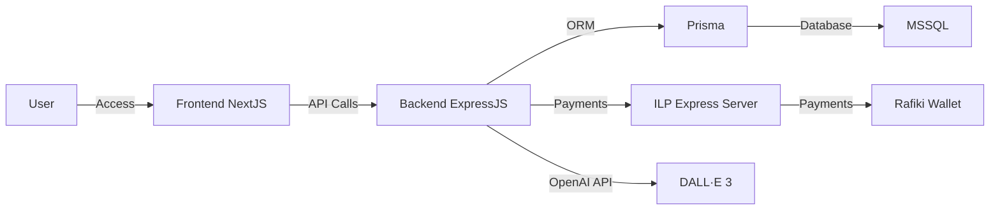
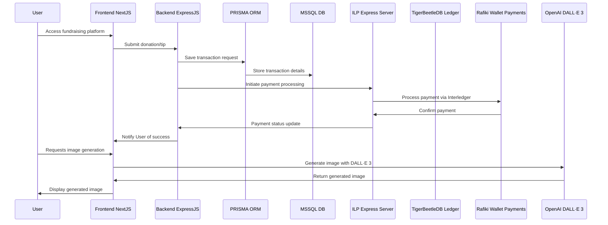

# FundSecure

FundSecure is a fundraising platform that allows users to create projects, receive donations/tips securely using the Interledger Protocol (ILP), and leverages OpenAI's DALL·E 3 for image generation. The platform ensures secure transactions and seamless integration between the frontend and backend services.


[](https://youtu.be/7rTIABujkPk)


## Table of Contents

- [How the App Works](#how-the-app-works)
- [OpenAI DALL·E 3 Integration](#openai-dall·e-3-integration)
- [Architecture](#architecture)
  - [Component Diagram](#component-diagram)
  - [Sequence Diagram](#sequence-diagram)
- [How to Run FundSecure Locally](#how-to-run-fundsecure-locally)
  - [Prerequisites](#prerequisites)
  - [Steps](#steps)
- [Production](#production)

## How the App Works

FundSecure enables users to create fundraising projects and receive donations through a secure and efficient process:

1. **User Interaction**: Users access the platform to create or view fundraising projects.
2. **Project Creation**: Users can create projects, providing details and using DALL·E 3 to generate images.
3. **Donations**: Donors can tip or donate to projects securely via ILP.
4. **Payment Processing**: Payments are processed through the ILP Express server, ensuring fast and secure transactions.
5. **Data Management**: All project and transaction data are managed using Prisma ORM with a MSSQL database.

## OpenAI DALL·E 3 Integration

FundSecure integrates with OpenAI's DALL·E 3 to allow users to generate unique images for their fundraising projects. This feature enhances project presentations and helps attract more donors.

## Architecture

### Component Diagram



### Sequence Diagram



## How to Run FundSecure Locally

### Prerequisites

Ensure you have the following installed:

- **Node.js** (v16 or higher)
- **Docker** (for microservices)
- **MSSQL** (locally or via a cloud database)
- **Prisma** (ORM)
- **npm** (Node Package Manager)

### Steps

1. **Clone the repository**:

   ```bash
   git clone https://github.com/ADGSTUDIOS/InterledgerHackathon
   cd InterledgerHackathon
   ```

2. **Install dependencies**:

   ```bash
   npm install
   cd ilp && npm install
   ```

3. **Configure environment variables**:

   Create a `.env` file in the root directory and set your environment variables.

   Example `.env` file:

   ```bash
   GOOGLE_CLIENT_ID=your_google_client_id
   GOOGLE_CLIENT_SECRET=your_google_client_secret
   NEXTAUTH_SECRET=your_nextauth_secret
   NEXTAUTH_URL=http://localhost:3000
   OPENAI_API_KEY=your_openai_api_key
   ```

   **Note**: Replace the placeholders with your actual credentials.

4. **Set up the database**:

   Run Prisma migrations to set up the MSSQL database schema:

   ```bash
   npx prisma db push
   ```

5. **Run Docker (for microservices)**:

   Start the Docker containers using Docker Compose:

   ```bash
   docker-compose up
   ```

6. **Start the development server**:

   Launch the app in development mode:

   ```bash
   npm run dev
   ```

7. **Access the app**:

   Visit [http://localhost:3000](http://localhost:3000) in your browser to access the app.

## Production

Run the following command to build the app for production:

```bash
npm run build
```

Start the app in production mode:

```bash
npm start
```

## Scripts Explained

The project uses npm scripts defined in the `package.json` file to streamline development and production tasks, utilizing `concurrently` to run multiple commands at once.

```json
"scripts": {
  "dev": "prisma generate && concurrently \"next dev\" \"node ilp/server.js\"",
  "build": "prisma generate && prisma db push && next build",
  "format:write": "prettier --write \"**/*.{css,js,json,jsx,ts,tsx}\"",
  "format": "prettier \"**/*.{css,js,json,jsx,ts,tsx}\"",
  "start": "npm run build && concurrently \"next start\" \"node ilp/server.js\"",
  "lint": "next lint"
}
```

- **dev**: Generates Prisma client and runs both the Next.js development server and the ILP Express server concurrently.
- **build**: Generates Prisma client, pushes the Prisma schema to the database, and builds the Next.js app.
- **format:write**: Formats the codebase using Prettier and writes changes.
- **format**: Checks code formatting without making changes.
- **start**: Runs the build script and then starts both the Next.js server and ILP Express server concurrently in production mode.
- **lint**: Runs Next.js's linting tool.

## Database Schema (Prisma)

The app uses Prisma as an ORM to interact with a MSSQL database. Below is an overview of the main models:

```prisma
datasource db {
  provider = "sqlserver"
  url      = "your_database_connection_string"
}

generator client {
  provider = "prisma-client-js"
}

model User {
  id            Int       @id @default(autoincrement())
  name          String?
  email         String?   @unique
  projects      Project[]
  accounts      Account[]
  sessions      Session[]
  createdAt     DateTime  @default(now())
  updatedAt     DateTime  @updatedAt
}

model Project {
  id           Int       @id @default(autoincrement())
  userId       Int
  title        String
  description  String
  bannerImage  String
  markDownCode String
  tips         Tip[]
  goal         String
  deadline     String
  createdAt    DateTime  @default(now())
  updatedAt    DateTime  @updatedAt

  user User @relation(fields: [userId], references: [id])
}

model Tip {
  id          Int      @id @default(autoincrement())
  projectId   Int
  amount      Float
  timeStamp   String
  hash        String   @unique
  interactRef String
  createdAt   DateTime @default(now())

  project Project @relation(fields: [projectId], references: [id])
}
```

## ILP Express Server (`ilp/server.js`)

The ILP Express server handles payment processing via the Interledger Protocol. It communicates with the Rafiki Wallet for payment settlements and records transactions in TigerBeetleDB.

**Key Functions:**

- **`/create-payment` Endpoint**: Initiates a new payment process.
- **Grant Management**: Handles grant requests and responses for secure payment authorization.
- **Error Handling**: Logs and returns appropriate error messages.

**Note**: Ensure that you have the necessary environment variables and configuration set up for the ILP server to function correctly.

---

### Screenshots


Feel free to contribute to the project or raise issues if you encounter any problems. Happy fundraising!
